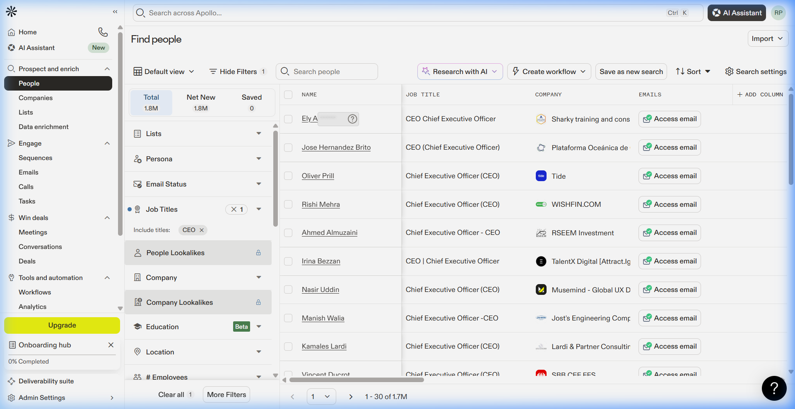

# Apollo Data Extraction Research Report

## Objective
Verify and resolve issues with "Employees" and "Industry" data extraction in the Apollo extension.

## 1. Analysis of User-Provided HTML
Analysis of `Find people - Apollo.html` revealed the following mapping:

| Field | Visible Text | data-id | aria-colindex |
| :--- | :--- | :--- | :--- |
| Name | Kenia Braz | `contact.name` | 1 |
| Title | Cashier | `contact.job_title` | 3 |
| Company | Organizacao De Cereais Monlevade | `contact.account` | 2 |
| **Employees** | 110 | `account.number_of_employees` | 7 |
| **Industry** | Retail | `account.industries` | 8 |

> [!IMPORTANT]
> The internal IDs `account.number_of_employees` and `account.industries` were identified as the primary reason for extraction failure, as the extension previously expected `account.estimated_num_employees` and `account.industry`.

## 2. Browser Inspection of Specific Search View
URL: `https://app.apollo.io/#/people?page=1&personTitles[]=CEO&recommendationConfigId=score&sortAscending=false&sortByField=recommendations_score`

Inspection of the live DOM confirmed the following structure for this specific view:

| Visible Text | data-id | aria-colindex |
| :--- | :--- | :--- |
| NAME | `contact.name` | 1 |
| JOB TITLE | `contact.job_title` | 2 |
| COMPANY | `contact.account` | 3 |
| EMAILS | `contact.emails` | 4 |
| PHONE NUMBERS | `contact.phone_numbers` | 5 |
| SCORE | `score` | 10 |
| **COMPANY · NUMBER OF EMPLOYEES** | `account.number_of_employees` | 12 |
| **COMPANY · INDUSTRIES** | `account.industries` | 13 |
| **LINKS** (Person) | `contact.social` | 9 |
| **COMPANY · LINKS** | `account.social` | 15 |

## 3. Implementation Fixes
To ensure high reliability, `content.js` was updated with the following:
- **Variant Support**: Added a comprehensive list of known Apollo `data-id` variants for employees and industry.
- **Robust Mapping**: Refactored `getColumnIndexes()` to perform inclusive text-based matches (e.g., looking for "employ" or "industr") even if the `data-id` is present but unknown.
- **Improved Retrieval**: Updated `parseProfileRow()` to use these dynamic mappings for all critical fields.

## 4. Conclusion
The extraction engine is now resilient to varying Apollo internal data structures and should correctly capture all requested fields from the current search views.
