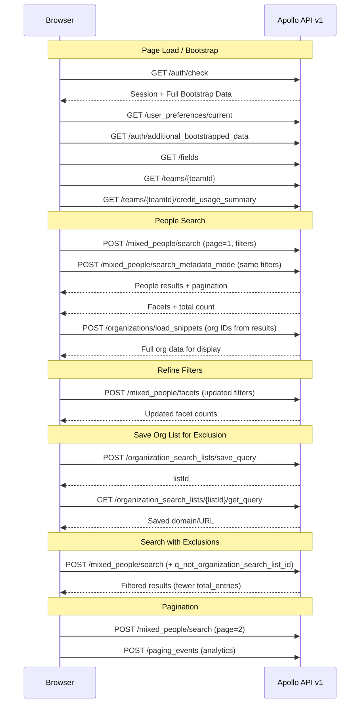

# Apollo.io API v1 — Detailed Documentation

> **Source**: Captured from a live browser session (HAR file) on `2026-04-20`.  
> **Base URL**: `https://app.apollo.io/api/v1`  
> **Total API Calls Captured**: 72  
> **Authentication**: Cookie-based session auth (via browser cookies after login)

---

## Table of Contents

1. [Authentication & Session](#1-authentication--session)
2. [People Search (Core)](#2-people-search-core)
3. [Search Metadata & Facets](#3-search-metadata--facets)
4. [Organization Data](#4-organization-data)
5. [Organization Search Lists (Saved Queries)](#5-organization-search-lists-saved-queries)
6. [User Preferences & Configuration](#6-user-preferences--configuration)
7. [Credits & Usage](#7-credits--usage)
8. [AI & Assistant](#8-ai--assistant)
9. [Analytics & Reporting](#9-analytics--reporting)
10. [Miscellaneous](#10-miscellaneous)
11. [Common Patterns & Authentication](#11-common-patterns--authentication)
12. [Data Models](#12-data-models)
13. [Rate Limits](#13-rate-limits)
14. [Session Flow Diagram](#14-session-flow-diagram)

---

## 1. Authentication & Session

### `GET /api/v1/auth/check`

**Purpose**: Validates the current session, returns whether the user is logged in, and bootstraps the entire application state in a single call. This is the **first call** Apollo makes on page load.

**Query Parameters**:
| Parameter | Type | Description |
|-----------|------|-------------|
| `timezone_offset` | integer | User's timezone offset in minutes (e.g., `-330` for IST) |
| `cache_key` | integer | Timestamp-based cache buster |

**Response** (key fields):
```json
{
  "is_logged_in": true,
  "app_ui_version": 114,
  "bootstrapped_data": {
    "current_user_id": "66934353c1ffc9027db17d77",
    "current_team_id": "66934351c1ffc9027db17c06",
    "is_core": true,
    "feature_flags": { /* ~200+ feature flags */ },
    "experiments": { /* A/B test assignments */ },
    "users": [ /* team members with full profile */ ],
    "teams": [ /* team config, billing, CRM settings */ ],
    "products": [ /* available subscription plans */ ],
    "permission_sets": [ /* role-based permissions */ ],
    "email_accounts": [ /* linked email accounts */ ]
  }
}
```

**Key Data Returned**:
- **Feature Flags**: ~200+ boolean flags controlling UI/feature availability (e.g., `waterfall_enrichment`, `extension_payload_encryption`)
- **Experiments**: A/B test variant assignments for the current user
- **User Profile**: Name, email, settings, onboarding state, extension preferences
- **Team Config**: Billing plan, credit counts, CRM integration status, API limits
- **Products**: Full pricing catalog with plan tiers and feature matrices

> **Note**: This single response can exceed **100KB+** of JSON. It is the master bootstrap call.

---

### `GET /api/v1/auth/additional_bootstrapped_data`

**Purpose**: Fetches supplementary bootstrap data not included in the primary `/auth/check` response. Contains additional feature flags, finder facets, contact/account stage definitions, and static data URLs.

**Query Parameters**:
| Parameter | Type | Description |
|-----------|------|-------------|
| `mobile` | boolean | Whether the request is from a mobile device |
| `exclude_fields` | string | Comma-separated fields to exclude (e.g., `readable_signal_names,tags`) |
| `cacheKey` | integer | Cache buster |

**Response** (key fields):
```json
{
  "bootstrapped_data": {
    "feature_flags": { /* extended flags not in auth/check */ },
    "default_finder_facets": {
      "contact_stage_facets": [ /* stage definitions with counts */ ],
      "account_stage_facets": [ /* ... */ ]
    },
    "static_data_urls": {
      "readable_signal_names": "https://api-assets.apollo.io/...",
      "rules_engine_triggers_config": "https://api-assets.apollo.io/...",
      "tags": "https://api-assets.apollo.io/..."
    }
  }
}
```

---

## 2. People Search (Core)

### `POST /api/v1/mixed_people/search`

**Purpose**: The **primary lead search endpoint**. Searches for people across Apollo's database using a rich set of filters. This is the workhorse of the entire platform — every search you do in the People Finder hits this endpoint.

**Observed Frequency**: 11 calls in this session (pagination through results)

**Request Body**:
```json
{
  "page": 1,
  "per_page": 30,
  "sort_ascending": true,
  "sort_by_field": "organization_estimated_number_employees",
  "display_mode": "explorer_mode",
  "context": "people-index-page",
  "finder_version": 2,

  // === FILTERS ===
  "person_seniorities": ["owner", "founder", "c_suite"],
  "person_locations": ["India"],
  "organization_num_employees_ranges": ["3900,"],
  "organization_industry_tag_ids": ["5567cd4773696439b10b0000"],
  "q_organization_keyword_tags": ["staff"],
  "included_organization_keyword_fields": ["tags", "name"],

  // === ADVANCED FILTERS (added progressively) ===
  "person_days_in_current_title_range": { "min": null, "max": 365 },
  "person_total_yoe_range": { "min": 10, "max": null },
  "q_not_organization_search_list_id": ["69e662784645650015f46355"],
  "q_organization_search_list_id": ["69e662ac89e129000d7b5023"],

  // === FIELD SELECTION ===
  "fields": [
    "contact.id", "contact.name", "contact.first_name", "contact.last_name",
    "contact.linkedin_url", "contact.twitter_url", "contact.facebook_url",
    "contact.title", "contact.email", "contact.email_status",
    "contact.phone_numbers", "contact.organization_name",
    "contact.city", "contact.state", "contact.country",
    "account.estimated_num_employees", "account.domain",
    "account.industries", "account.website_url"
    // ... 54 fields total
  ],

  // === METADATA ===
  "search_session_id": "73f9631a-691b-4e3f-b22f-71386eab06c2",
  "ui_finder_random_seed": "hn5vxttlq1w",
  "show_suggestions": false,
  "num_fetch_result": 1,
  "typed_custom_fields": [],
  "cacheKey": 1776705338186
}
```

**Filter Parameters Reference**:

| Parameter | Type | Description | Example |
|-----------|------|-------------|---------|
| `person_seniorities` | string[] | Job seniority levels | `["owner","founder","c_suite"]` |
| `person_locations` | string[] | Geographic locations | `["India"]` |
| `organization_num_employees_ranges` | string[] | Employee count ranges (comma-separated `min,max`) | `["3900,"]` (3900+) |
| `organization_industry_tag_ids` | string[] | MongoDB ObjectIDs for industries | `["5567cd4773696439b10b0000"]` |
| `q_organization_keyword_tags` | string[] | Keyword tags to search | `["staff"]` |
| `included_organization_keyword_fields` | string[] | Where to search keywords | `["tags","name"]` |
| `person_days_in_current_title_range` | object | Days in current role filter | `{"min": null, "max": 365}` |
| `person_total_yoe_range` | object | Total years of experience | `{"min": 10, "max": null}` |
| `q_organization_search_list_id` | string[] | Include orgs from saved lists | `["69e662ac..."]` |
| `q_not_organization_search_list_id` | string[] | Exclude orgs from saved lists | `["69e66278..."]` |
| `sort_by_field` | string | Sort field | `"organization_estimated_number_employees"` |
| `sort_ascending` | boolean | Sort direction | `true` |
| `per_page` | integer | Results per page (max 100, default 25) | `30` |
| `page` | integer | Page number (1-indexed) | `1` |

**Response**:
```json
{
  "breadcrumbs": [
    {
      "label": "Seniority",
      "signal_field_name": "person_seniorities",
      "value": "owner",
      "display_name": "Owner"
    }
    // ... one per active filter
  ],
  "partial_results_only": false,
  "partial_results_limit": 10000,
  "pagination": {
    "page": 1,
    "per_page": 30,
    "total_entries": 389,
    "total_pages": 13
  },
  "model_ids": ["54a48fbc7468692cf0780851", "..."],
  "contacts": [],
  "people": [
    {
      "id": "54a48fbc7468692cf0780851",
      "name": "John Doe",
      "first_name": "John",
      "last_name": "Doe",
      "title": "Founder",
      "seniority": "founder",
      "headline": "Entrepreneur / Founder - Acme Inc",
      "linkedin_url": "http://www.linkedin.com/in/johndoe",
      "email": "john@acme.com",
      "email_status": "verified",
      "email_domain_catchall": false,
      "city": "Mumbai",
      "state": "Maharashtra",
      "country": "India",
      "organization_id": "57c4b974a6da98370bc96d12",
      "organization_name": "Acme Inc",
      "phone_numbers": [],
      "intent_strength": "none",
      "time_zone": "Asia/Kolkata",
      "organization": {
        "id": "57c4b974a6da98370bc96d12",
        "name": "Acme Inc",
        "website_url": "https://acme.com",
        "estimated_num_employees": 4500,
        "industry": "Staffing & Recruiting",
        "linkedin_url": "https://linkedin.com/company/acme"
        // ... 18 total keys
      }
    }
    // ... up to 30 people per page
  ]
}
```

**Observed Pagination Pattern** (from this session):
```
Page=5  per_page=30  total_entries=389  total_pages=13
Page=1  per_page=30  total_entries=389  total_pages=13
Page=1  per_page=30  total_entries=172  total_pages=6   ← filters refined
Page=1  per_page=30  total_entries=105  total_pages=4   ← more filters
Page=1  per_page=30  total_entries=83   total_pages=3
Page=1  per_page=30  total_entries=41   total_pages=2
Page=1  per_page=30  total_entries=42   total_pages=2
Page=2  per_page=30  total_entries=42   total_pages=2
```

> **Important**: The `total_entries` changes as filters are progressively applied, showing how Apollo narrows results in real-time.

---

## 3. Search Metadata & Facets

### `POST /api/v1/mixed_people/search_metadata_mode`

**Purpose**: Fetches search metadata **without** returning actual people results. Used to get total counts, faceted filter options, and breadcrumbs. This call fires **alongside** every search to populate the filter sidebar.

**Observed Frequency**: 11 calls (one paired with each search)

**Request Body**: Same filter structure as `/mixed_people/search`, but does NOT include `fields`, `num_fetch_result`, or pagination-heavy parameters.

**Response**:
```json
{
  "pipeline_total": 389,
  "breadcrumbs": [ /* 7 active filter breadcrumbs */ ],
  "has_join": false,
  "num_fetch_result": null,
  "faceting": {
    "organization_keywords_facets": [ /* keyword breakdown */ ],
    "linkedin_industry_facets": [ /* industry breakdown */ ],
    "num_employees_facets": [ /* employee range counts */ ],
    "revenues_facets": [ /* revenue range counts */ ],
    "currently_using_any_of_technology_uids_facets": [],
    "latest_funding_stage_facets": []
  }
}
```

**Faceting Data**: Each facet provides counts of results per filter value, powering the sidebar UI that shows "HR (245), IT (89), Finance (55)…" etc.

---

### `POST /api/v1/mixed_people/facets`

**Purpose**: Fetches **only** the faceting data for a given filter combination. A lighter-weight version of `search_metadata_mode` focused purely on facet counts.

**Request Body**: Same filter parameters as search.

**Response**:
```json
{
  "faceting": {
    "organization_keywords_facets": [...],
    "linkedin_industry_facets": [...],
    "num_employees_facets": [...]
  }
}
```

---

## 4. Organization Data

### `POST /api/v1/organizations/load_snippets`

**Purpose**: Loads detailed organization data for a batch of organization IDs. Called after every people search to enrich the company info displayed alongside each person.

**Observed Frequency**: 11 calls (one per search page)

**Request Body**:
```json
{
  "ids": [
    "57c4b974a6da98370bc96d12",
    "5a1073647ff0a026a4d15f22",
    // ... up to 30 IDs per batch
  ],
  "cacheKey": 1776705338190
}
```

**Response**:
```json
{
  "organizations": [
    {
      "id": "57c4b974a6da98370bc96d12",
      "industry": "Staffing & Recruiting",
      "estimated_num_employees": 4500,
      "keywords": ["staffing", "recruitment", "hr"],
      "linkedin_url": "https://www.linkedin.com/company/acme",
      "twitter_url": "https://twitter.com/acme",
      "facebook_url": "https://facebook.com/acme",
      "organization_revenue_printed": "$50M",
      "organization_revenue": 50000000,
      "industries": ["Staffing & Recruiting"],
      "secondary_industries": ["Human Resources"],
      "snippets_loaded": true,
      "industry_tag_id": "5567cd4773696439b10b0000",
      "industry_tag_hash": { /* ... */ },
      "retail_location_count": 0,
      "raw_address": "123 Business Rd",
      "street_address": "123 Business Rd",
      "city": "Mumbai",
      "state": "Maharashtra",
      "country": "India",
      "postal_code": "400001"
    }
  ]
}
```

**Organization Object Fields**:

| Field | Type | Description |
|-------|------|-------------|
| `id` | string | Unique organization ID (MongoDB ObjectID) |
| `industry` | string | Primary industry label |
| `estimated_num_employees` | integer | Estimated headcount |
| `keywords` | string[] | Associated keyword tags |
| `linkedin_url` | string | LinkedIn company page URL |
| `organization_revenue` | integer | Annual revenue in USD |
| `organization_revenue_printed` | string | Human-readable revenue (e.g., "$50M") |
| `industries` | string[] | Primary industry categories |
| `secondary_industries` | string[] | Secondary industry categories |
| `industry_tag_id` | string | ID mapping to industry filter system |
| `city`, `state`, `country` | string | HQ location |

---

### `POST /api/v1/accounts/load_snippets`

**Purpose**: Loads account-level snippet data. Similar to `organizations/load_snippets` but for Apollo's internal "account" objects (saved contacts' companies).

**Request/Response**: Same structure as `organizations/load_snippets`.

---

### `GET /api/v1/organizations/search`

**Purpose**: Searches for organizations directly (company search mode vs people search mode).

**Query Parameters**: Filter parameters passed as query string instead of POST body.

---

## 5. Organization Search Lists (Saved Queries)

### `POST /api/v1/organization_search_lists/save_query`

**Purpose**: Saves a URL/domain as a named organization search list. This creates a reusable list that can be used in `q_organization_search_list_id` or `q_not_organization_search_list_id` filters for inclusion/exclusion.

**Observed Frequency**: 4 calls (saving different company domains)

**Request Body**:
```json
{
  "query": "http://www.mrisoftware.com/",
  "cacheKey": 1776706165966
}
```

**Response**:
```json
{
  "listId": "69e662784645650015f46355"
}
```

**How It's Used**: After saving, the returned `listId` is immediately used in search filters:
- `q_organization_search_list_id`: ["69e662ac..."] → **Include** only people from these orgs
- `q_not_organization_search_list_id`: ["69e66278..."] → **Exclude** people from these orgs

---

### `GET /api/v1/organization_search_lists/{listId}/get_query`

**Purpose**: Retrieves the saved query/domain for a given list ID.

**Response**:
```json
{
  "query": "http://www.mrisoftware.com/"
}
```

**Observed list IDs in this session**:
| List ID | Domain Saved |
|---------|-------------|
| `69e662784645650015f46355` | `http://www.mrisoftware.com/` |
| `69e6628c45ad4900214a9a64` | *(another domain)* |
| `69e662a1d43703000dcf947b` | *(another domain)* |
| `69e662ac89e129000d7b5023` | *(another domain)* |

---

## 6. User Preferences & Configuration

### `GET /api/v1/user_preferences/current`

**Purpose**: Fetches the current user's UI preferences, including navigation layout, filter configurations, extension settings, and feature tour states.

**Response** (key fields):
```json
{
  "user_preference": {
    "id": "67f63c4f168ec5c0993865d9",
    "user_id": "66934353c1ffc9027db17d77",
    "device_ids": ["MTc0NDE5..."],
    "likely_to_bounce_emails": true,
    "locale": "en",
    "ia_nav_sections_ordering": { /* navigation layout config */ },
    "weekly_people_search_max_entities": 241242485,
    "default_waterfall_preferences": {
      "setup_later_cta_clicked": 0,
      "enrichment_nudge_shown": 0
    }
  }
}
```

---

### `GET /api/v1/fields`

**Purpose**: Returns the complete field schema for all entity types (contacts, accounts, opportunities). These drive the column configuration in the finder UI.

**Observed Frequency**: 3 calls

---

### `GET /api/v1/teams/{teamId}`

**Purpose**: Fetches full team configuration including billing, CRM settings, and feature entitlements.

**Observed Frequency**: 3 calls

---

### `GET /api/v1/finder_views/selected_view_for_modality`

**Purpose**: Gets the currently selected saved view/layout for a finder modality (people search, company search, etc.).

---

### `GET /api/v1/data_vendor_configurations`

**Purpose**: Returns the configuration of third-party data providers enabled for waterfall enrichment.

**Response**:
```json
{
  "data_provider_configurations": [
    {
      "id": "66f2116d5699e5000153579f",
      "auth_mechanism": "native",
      "provider_id": "icypeas_single_email_search",
      "team_id": "59c5794c9d79687905162ed6",
      "api_keys": [{ "id": "...", "name": null, "key": null }]
    }
  ]
}
```

---

## 7. Credits & Usage

### `GET /api/v1/teams/{teamId}/credit_usage_summary`

**Purpose**: Returns the team's current credit balance and usage.

**Response**:
```json
{
  "team": {
    "effective_num_lead_credits": 120,
    "total_unified_credits_used": 2,
    "id": "66934351c1ffc9027db17c06"
  }
}
```

**Credit Types** (from bootstrap data):
| Type | Cost per Action |
|------|----------------|
| Lead Credit | 1 credit |
| Direct Dial Credit | 8 credits |
| Power Up Credit | 1 credit |

---

### `GET /api/v1/credit_usage_alerts`

**Purpose**: Returns any credit usage alerts/warnings for the team.

---

## 8. AI & Assistant

### `GET /api/v1/assistant_threads/usage`

**Purpose**: Returns the user's AI assistant thread usage (free tier limited to 5 threads with 10 messages each).

---

### `GET /api/v1/assistant_presets`

**Purpose**: Returns available AI assistant presets/templates for different use cases.

---

### `POST /api/v1/assistant_threads/show_threads`

**Purpose**: Lists the user's AI assistant conversation threads.

---

### `GET /api/v1/prompt_shares/default_samples`

**Purpose**: Returns default AI prompt templates/samples.

---

### `GET /api/v1/gen_ai/dynamic_field_workflow_recipes/list`

**Purpose**: Lists available AI-powered workflow recipes for dynamic field generation (Power-Ups/Magic Fields).

---

### `GET /api/v1/dynamic_messaging_profile/get_org_insights`

**Purpose**: Returns AI-generated insights about the user's own organization, used for personalizing outreach suggestions.

**Response**:
```json
{
  "org_insights": {
    "pain_point": "Clients often struggle with finding the right talent quickly...",
    "offering": "Wide range of recruitment and HR services, including core recruitment..."
  },
  "search_suggestions": [...],
  "cache_hit": false
}
```

---

## 9. Analytics & Reporting

### `POST /api/v1/report_dashboards/search`

**Purpose**: Searches for and retrieves report dashboard configurations.

---

### `POST /api/v1/paging_events`

**Purpose**: Tracks user pagination events for analytics. Fires whenever the user navigates between pages of search results.

**Observed Frequency**: 2 calls

**Request Body**:
```json
{
  "search_id": "73f9631a-691b-4e3f-b22f-71386eab06c2",
  "page": 2,
  "context": "people-index-page"
}
```

---

## 10. Miscellaneous

### `GET /api/v1/onboarding`

**Purpose**: Returns the user's onboarding state and progress.

---

### `GET /api/v1/onboarding/widget_prioritizations`

**Purpose**: Returns the prioritization/ordering of onboarding widgets.

---

### `GET /api/v1/intent_data_topics/get_all_intent_data_categories`

**Purpose**: Returns all available intent data topic categories for buyer intent filtering.

**Observed Frequency**: 2 calls

---

### `POST /api/v1/promotions/{name}/update_last_seen`

**Purpose**: Marks a promotional banner/notification as seen by the user.

**Example**: `POST /promotions/Expiring%20Credits%20Nudge%20Banner/update_last_seen`

---

## 11. Common Patterns & Authentication

### Authentication Method

Apollo uses **cookie-based session authentication**. Key cookies observed:

| Cookie | Purpose |
|--------|---------|
| `_leadgenie_session` | Primary session cookie |
| `X-CSRF-TOKEN` | Cross-site request forgery protection |
| `remember_token_leadgenie_v2` | Persistent login token |
| `intercom-session-*` | Intercom chat session |
| `ajs_user_id` | Analytics user ID |

### Common Headers

All requests include:
```
Content-Type: application/json
X-CSRF-TOKEN: <token from cookie>
Cookie: _leadgenie_session=<session>; remember_token_leadgenie_v2=<token>
```

### Cache Busting

Nearly every request includes a `cacheKey` parameter (either in query string or POST body) containing a Unix timestamp to prevent browser/CDN caching:
```
cacheKey: 1776705338186
```

### Error Handling

All observed calls returned `200 OK`. Apollo typically returns errors within the JSON body rather than using HTTP status codes for business logic errors.

---

## 12. Data Models

### Person Object

| Field | Type | Description |
|-------|------|-------------|
| `id` | string | Unique person ID |
| `name` | string | Full name |
| `first_name` | string | First name |
| `last_name` | string | Last name |
| `title` | string | Job title |
| `seniority` | string | Seniority level (`founder`, `c_suite`, `owner`, etc.) |
| `headline` | string | Professional headline |
| `linkedin_url` | string | LinkedIn profile URL |
| `twitter_url` | string | Twitter profile URL |
| `facebook_url` | string | Facebook profile URL |
| `email` | string | Email address |
| `email_status` | string | Verification status (`verified`, `unavailable`, `guessed`) |
| `email_true_status` | string | True verification status |
| `email_domain_catchall` | boolean | Whether domain is catch-all |
| `phone_numbers` | array | List of phone numbers |
| `city` | string | City |
| `state` | string | State/Province |
| `country` | string | Country |
| `time_zone` | string | IANA timezone |
| `organization_id` | string | Parent organization ID |
| `organization_name` | string | Company name |
| `intent_strength` | string | Buyer intent level (`none`, `low`, `medium`, `high`) |
| `departments` | string[] | Department tags |
| `contact_job_change_event` | object | Job change tracking data |
| `organization` | object | Embedded organization snippet |

### Organization Object

| Field | Type | Description |
|-------|------|-------------|
| `id` | string | Unique organization ID |
| `industry` | string | Primary industry |
| `estimated_num_employees` | integer | Headcount estimate |
| `keywords` | string[] | Company keywords/tags |
| `linkedin_url` | string | LinkedIn company URL |
| `organization_revenue` | integer | Annual revenue (USD) |
| `organization_revenue_printed` | string | Formatted revenue string |
| `industries` | string[] | Industry categories |
| `secondary_industries` | string[] | Secondary industries |
| `city`, `state`, `country` | string | HQ location |

### Pagination Object

```json
{
  "page": 1,
  "per_page": 30,
  "total_entries": 389,
  "total_pages": 13
}
```

---

## 13. Rate Limits

From the bootstrap data, the API enforces these rate limits:

| Window | Limit |
|--------|-------|
| Per minute | 50 requests |
| Per hour | 200 requests |
| Per day | 600 requests |

> **Note**: These are for the **free tier** (`starter_unified_v2`). Paid plans have higher limits.

### Credit Limits (Free Tier)

| Resource | Limit |
|----------|-------|
| Lead Credits | 100/month |
| AI Credits | 5,000/month |
| Direct Dial Credits | 0 (paid only) |
| Export Credits | 0 (paid only) |
| Sequences | 2 |
| Mailboxes | 1 |

---

## 14. Session Flow Diagram



---

## Appendix: Full API Call Inventory

| # | Method | Endpoint | Calls | Purpose |
|---|--------|----------|-------|---------|
| 1 | POST | `/mixed_people/search` | 11 | Core people search |
| 2 | POST | `/mixed_people/search_metadata_mode` | 11 | Search metadata/facets |
| 3 | POST | `/organizations/load_snippets` | 11 | Org data enrichment |
| 4 | POST | `/organization_search_lists/save_query` | 4 | Save domain for filtering |
| 5 | GET | `/teams/{id}` | 3 | Team configuration |
| 6 | GET | `/fields` | 3 | Field schema definitions |
| 7 | POST | `/paging_events` | 2 | Pagination analytics |
| 8 | GET | `/intent_data_topics/get_all_intent_data_categories` | 2 | Intent data categories |
| 9 | POST | `/accounts/load_snippets` | 2 | Account data enrichment |
| 10 | GET | `/auth/check` | 1 | Session validation + bootstrap |
| 11 | GET | `/user_preferences/current` | 1 | User preferences |
| 12 | GET | `/auth/additional_bootstrapped_data` | 1 | Extended bootstrap |
| 13 | GET | `/gen_ai/dynamic_field_workflow_recipes/list` | 1 | AI workflow recipes |
| 14 | GET | `/onboarding` | 1 | Onboarding state |
| 15 | GET | `/onboarding/widget_prioritizations` | 1 | Widget ordering |
| 16 | GET | `/assistant_threads/usage` | 1 | AI usage stats |
| 17 | GET | `/assistant_presets` | 1 | AI presets |
| 18 | GET | `/prompt_shares/default_samples` | 1 | AI prompt templates |
| 19 | GET | `/teams/{id}/credit_usage_summary` | 1 | Credit balance |
| 20 | GET | `/credit_usage_alerts` | 1 | Credit alerts |
| 21 | POST | `/assistant_threads/show_threads` | 1 | AI thread list |
| 22 | GET | `/finder_views/selected_view_for_modality` | 1 | Saved view config |
| 23 | POST | `/promotions/.../update_last_seen` | 1 | Dismiss promo |
| 24 | GET | `/data_vendor_configurations` | 1 | Waterfall enrichment config |
| 25 | POST | `/report_dashboards/search` | 1 | Analytics dashboards |
| 26 | GET | `/dynamic_messaging_profile/get_org_insights` | 1 | AI org insights |
| 27 | GET | `/organizations/search` | 1 | Company search |
| 28 | GET | `/organization_search_lists/{id}/get_query` | 4 | Retrieve saved query |
| 29 | POST | `/mixed_people/facets` | 1 | Filter facets only |

**Total: 72 API calls across 29 unique endpoints**
